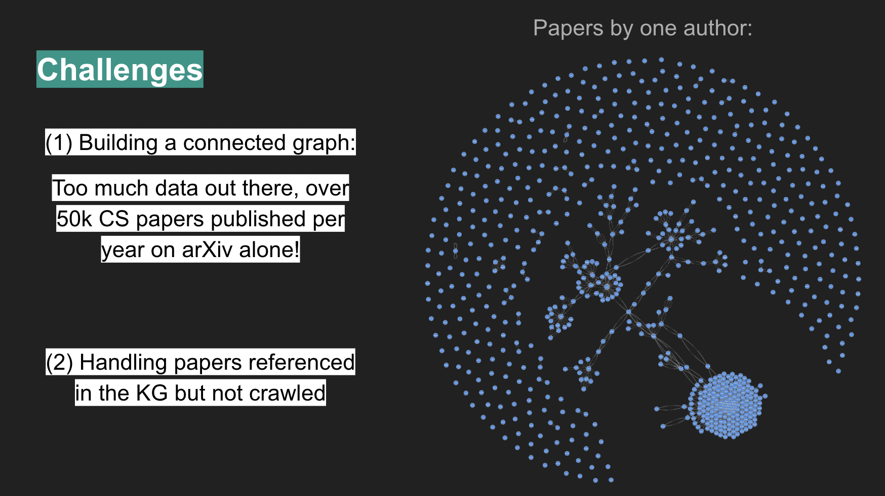
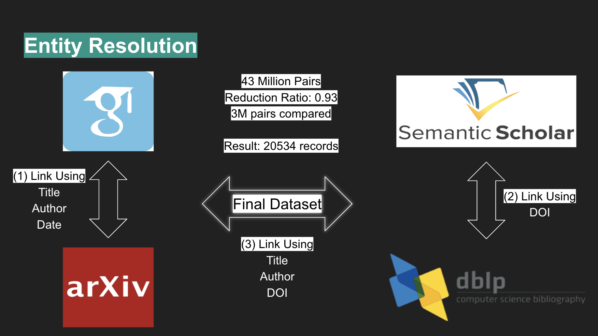
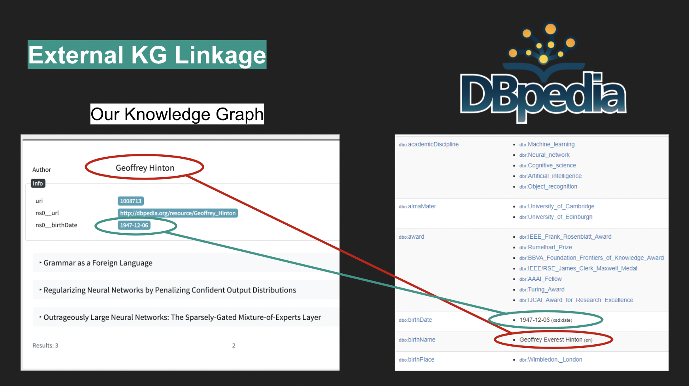
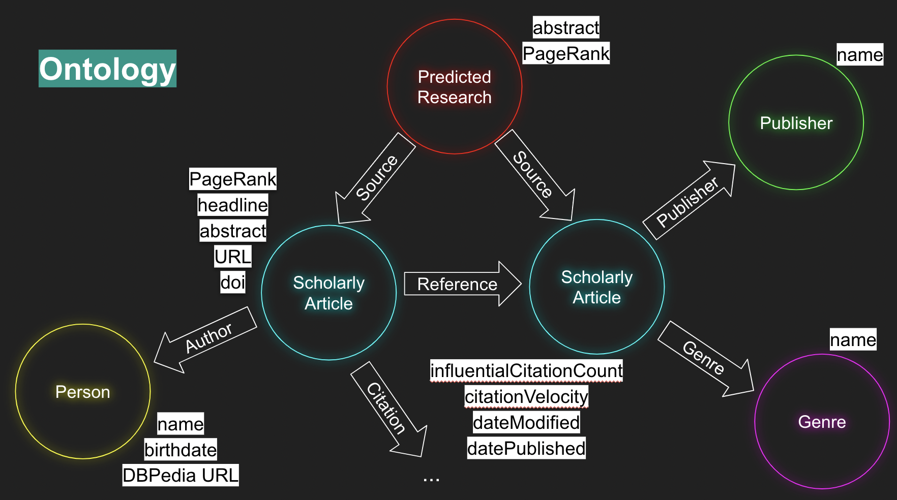
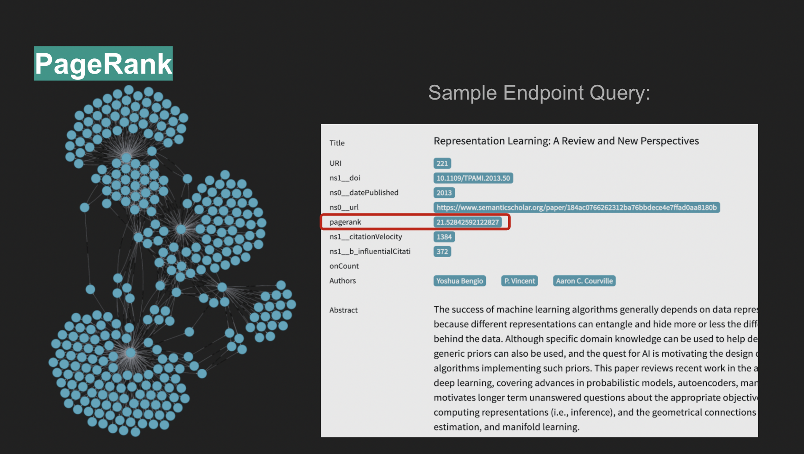
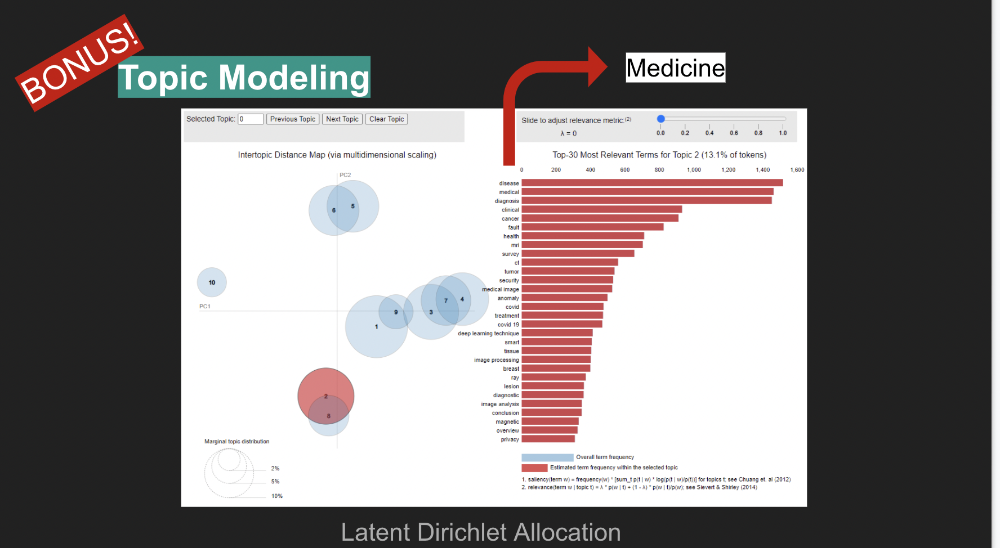
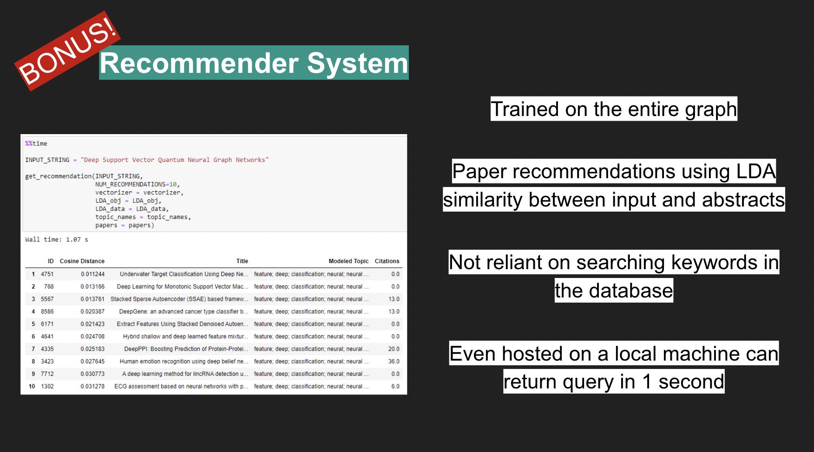
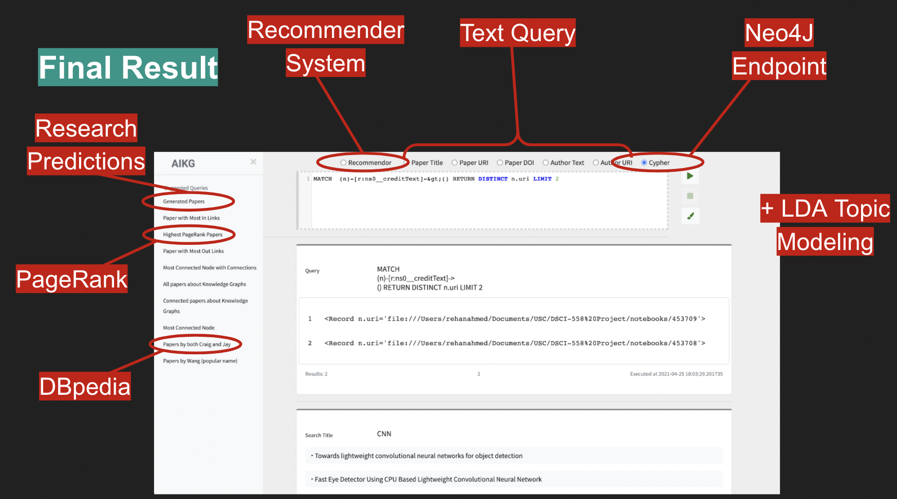

# Predicting Future Scientific Research with Knowledge Graphs

## Members
- [Matheus Schmitz](https://github.com/matheus-schmitz)
- [Rehan Ahmed](https://github.com/reallyrehan)

## 1. Introduction
The rise of Data Science as an academic discipline hails at least in part from its efficiency as a leverage tool, able to power-up many pre-existing data-dependent approaches to problem solving, knowledge discovery & comprehension, and predictive systems, among others.  
Looking to leverage this strength, this project was devised with the intent of combining data science techniques, primarily Knowledge Graphs and Artificial Intelligence, in the pursuit of uncovering trends and areas of interest for future scientific research.  
Given the volume of academic papers published every year, a subject matter for the development of the predictive system had to be decided upon. The authors saw no more suitable choice than Artificial Intelligence itself.  

## 2. Data Gathering
The data used through this project was obtained from four sources, all of which are well-regarded repositories of academic research, some wide-encompassing and others focused on topics pertinent to computer science. Those sources are: Google Scholar, arXiv, Semantic Scholar, and dblp. Data gathering was accomplished with a combination of web scraping tools (Scrapy) and APIs (Semantic Scholar, dblp). Multiple sources were necessary as each possesses complementary capabilities. Google Scholar allows for the mining of highly relevant papers, but not of their abstracts, while arXiv does not possess relevance but has abstracts and allows for crawling based on title, making it a perfect pairing for papers obtained from Google Scholar. 
Semantic Scholar for its turn has an API that vastly simplifies data crawling in large volumes. Its API’s json-formatted outputs enabled the creation of a “seed trail” crawler, which iteratively obtained papers based on the citations and references of previously crawled papers. This feature was critical for this project, as given the total size of the published data on the internet, if one were to randomly crawl papers, the resulting graph would be very sparsely connected. The “seed trail” crawling for its part creates a strongly connected graph, enabling many of the further steps of this project. 
dblp offers a simple DOI lookup tool which simplified the task of gathering complimentary information for the papers crawled from Semantic Scholar. 

## 3. Entity Resolution
Given the various sources used, entity resolution was performed in three steps: Firstly, Google Scholar and arXiv were merged using entity linkage functions that considered title, author, and date. Second, Semantic Scholar and dblp were merged using DOI. Third, the two previous merges were combined into one, based on title, author and DOI. Performing blocking by author achieved a reduction ratio of 0.93, shrinking a total of 43 million pairs into 3 million pairs for comparison. This resulted in 20534 unique papers. 
Using a validation set the authors found the True Positive Rate (TPR) of the entity linkage to be 99.53%. 

 
## 4. External Knowledge Graph Linkage 
Papers available on the aforementioned sources have no additional information about the authors other than their names. In order to complement that data, the crawled dataset was linked to DBPedia through programmatic queries to its 
API, which, thanks to an existing property dbo:academicDiscipline, enable a high precision (albeit not high recall, with only 298 matches) extraction of information about the papers’ authors. This data was appended to the dataset. 

 
## 5. Triple Generation & Ontology 
Using python’s RDFlib the dataset was converted into a set of RDF triples in the Turtle format.  All entity types, predicates and properties are derived from schema.org, xml, xds, foaf and DBpedia. 
The resulting ontology contains 4 entity types: Scholarly Article, Person, Genre, Publisher. 
Connecting those entities are 6 predicate (relationship) types: creditText, reference, citation, author, genre, publisher. 
The ontology uses a total of 12 property types: name, birthdate, DBPedia URL, PageRank, headline, abstract, URL, DOI, influentialCitationCount, citationVelocity, dateModified, datePublished. 
The main entity in the resulting RDF ontology is ScholarlyArticle, which contains the 20.5k academic articles crawled from the web with their full data, and another 435k articles which were mentioned as references but not crawled. An URI was also created for each of the references in each of the crawled papers to enable easy extending of the graph. 
Simple statistics about the triple generation process are as follows: 453k paper URIs (including references), 51k author URIs, 207 genres, 86 publishers, 1.5M relationships, 505k nodes, 2.65M tiples. 
The Turtle RDF was deployed to a Neo4J Graph Database and made available via an endpoint on a Flask user interface. 

 
## 6. PageRank 
Post deployment of the graph database, the PageRank algorithm was applied to it, allowing for the identification of the most relevant nodes in the graph. This addresses one of the identified challenges for this project which was providing novel functionality based on the gathered data, as a mere author/title query would not make the graph any more useful than the current relational databases from which the data was obtained. 

 
## 7. Predicting Future Research 
Combining a Knowledge Graph with Artificial Intelligence techniques to generate insights regarding potential new areas for scientific inquiry was the motivating factor for this project. Having the graph data as a start point, an NLP pipeline was then built to generate novel research predictions.  The model contains three main stages, the first consisting of priming the GPT2 model, which means selecting a number of existing abstracts to serve as the references for a new abstract to be generated and having the model parse through them. 
The second step was text generation itself, in which the model wrote a long article (sizes vary, but an average length was 4000 words). This route was chosen as, were the research predictions to be generated directly from the source abstracts, they would be highly correlated, with the predictions being no more than a reshuffle and rewrite of the abstracts contained in its sources’ papers, and thus useless at suggesting novel fields of exploration. 
The third and final stage consisted of writing a brand-new abstract for the “paper” written during stage two. Here HuggingFace’s summarization pipeline was employed, allowing the central topics of the large text to be condensed into a 500-word abstract whose manual evaluation showed it to be both novel and highly coherent in its grammar and structure. 
The quality of the predictions was assessed by evaluating their correlation with their sources, whereby for the purposes and intents of this project a low correlation was targeted, as, to satisfy the project’s goal of generating new and interesting insights for potential areas of research it is necessary for the predictions to be dissimilar from their sources, because were they to be similar they would then be useless in providing novel and unexpected ideas to be considered for research. The goal was not to predict what the abstract of a paper should be, but rather to generate yet-unseen concepts. For that metric it was found that only 7% of the papers had their sources among the top recommendations of similar papers – very good score. 
 
## 8. Topic Modeling 
A weakness identified during the triples generation step was the inconsistency in the topic structures among the sources, which totaled 207 distinct yet overlapping topics.  
Aiming to overcome this issue, a new Topic Modeling architecture was developed for the gathered data. The approach chosen is based on Latent Dirichlet Allocation (LDA). Experimentation revealed 10 to be a good choice for the number of topics among the highly connected data that was crawled for this project. This topic structure could then be applied to all the papers regardless of their origin, as the architecture was developed to find topic similarity based on the papers’ abstracts, which was available for all papers. The resulting topics allow for the clear identification of clusters of research, such as AI-Medicine, AI-Reinforcement Learning, AI-Transfer Learning, among others. 

 
## 9. Recommender System 
Furthering the goal of providing novel and differentiated utility based on Knowledge Graphs, the LDA-based topic model was leveraged to create a Recommender System, which allows the generation of paper recommendations based on latent similarity between the paper’s abstracts and a user-provided textual query. 
The backend technology for the Recommender System relies of Nearest-Neighbors Cosine Similarity over LDA vectorized strings. Graph nodes have precomputed vectors for increased performance. Upon manual evaluation the system proved highly satisfactory. 

 
## 10. User Interface 
Aiming at providing users a single hub for accessing and exploring all the work hereto presented, a Front-End user interface was developed via python’s Flask API.  
The Front-End allows access to the Back-End Neo4J database through both Cypher queries as well as textual queries for author, title and DOI, and URIs existing in the graph.  
Along with direct queries to the graph, the UI also allows queries to the Recommender System, which then returns the top 10 recommendations based on the query. A secondary tab allows users to visually explore the LDA derived topics, including their spatial distance in a condensed 2-dimensional space and the content of the words associated with each topic, whose LDA distribution can also be explored via an interactive TF-IDF weight manipulator. PageRank was precomputed for all nodes in the graph and comes available with any query returns for papers.  The DBPedia linkage data was also extracted and appended to the graph. It comes available with any query returns for authors. 
The future research predictions mentioned in item 7 were also added to the graph and can be found both via the content of their abstracts as well as via a unique predicate/relationship which identifies them: creditText, that points which source papers were used to generated a given research prediction.  

